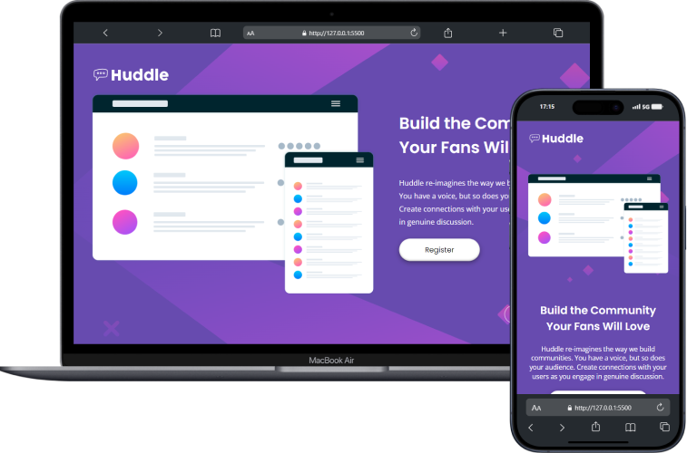

<h1>🪁 Huddle Landing Page</h1>

The Huddle was desenvolved into DevQuest Frontend course to improve our habilities with HTML and CSS. During development I had several challenges to resolve, like make the principal image responsive. If you had another better solution for something, let me know by pull request!

### 🚀 Technologies Used:

    
    

 

### 📷 Preview:

